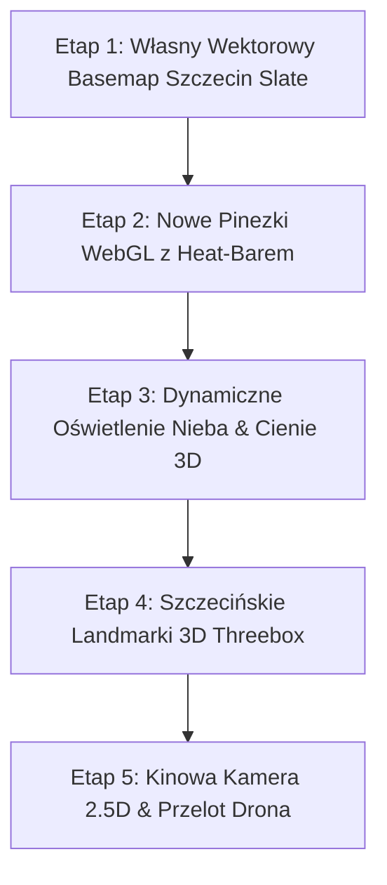

# 🗺️ Master Plan Wizualnego i Graficznego Udoskonalenia Mapy NaEtacie
> **Autor:** Lead GIS & Visual Systems Architect  
> **Status:** Gotowy do wdrożenia (Roadmapa Graficzna)  
> **Ramy technologiczne:** WebGL2, MapLibre GL v4/v5, Threebox / Three.js, Deck.gl, Framer Motion, Tailwind CSS  
> **Aestetyka:** *Rugged Baltic Industrial & High-Contrast Tactical HUD* (specyfika stoczniowo-budowlana Szczecina)

---

## 1. Koncepcja Wizualna: „Baltic Slate & High-Vis Tactical”

Większość map w portalach ogłoszeniowych wygląda jak generyczny, biało-szary szablon Google Maps z czerwonymi pinezkami. 
Mapa **NaEtacie** ma posiadać unikalną tożsamość wizualną dopasowaną do **szczecińskiego rynku pracy budowlanej**:
- **Dźwigi stoczniowe, rzeka Odra, ceglane kamienice i nowoczesne hale magazynowe**.
- Interfejs nawiązujący do **profesjonalnego sprzętu pomiarowego (Leica, Hilti, Bosch Professional)**: czytelny w ostrym słońcu na budowie, a wieczorem kinowy, głęboki i elegancki.

---

## 2. Architektura Wizualna – 7 Filarów Udoskonaleń

### Filar 1: Kinowa Atmosfera, Oświetlenie 3D i Niebo (Sky & Atmosphere WebGL)
* **Biblioteka:** MapLibre GL v4/v5 `sky` layer + `ambient-light` + `directional-light`.
* **Działanie:**
  - **Dynamiczne pory dnia:**
    - *06:00 – 08:00 (Poranek Fachowca):* Chłodne, złociste światło poranka pod kątem 15°, długie cienie budynków w stronę zachodnią.
    - *12:00 – 16:00 (Dzień Roboczy):* Neutralne, wysokokontrastowe światło, maksymalna czytelność ulic.
    - *17:00 – 21:00 (Złota Godzina & Zmierzch):* Ciepły błękitno-bursztynowy gradient nieba odbijający się w rzece Odrze.
  - **Cienie budynków w czasie rzeczywistym:** MapLibre 3D extrusions rzucające miękkie cienie w zależności od symulowanej godziny (krytyczne dla elewatorów i tynkarzy).

---

### Filar 2: Tekstury Rzeki Odry i Jeziora Dąbie (Procedural Water Shading)
* **Problem:** Woda na standardowej mapie to płaski, martwy niebieski wielokąt. W Szczecinie woda stanowi 25% powierzchni miasta!
* **Rozwiązanie:**
  - Dodanie customowego shadera WebGL / animowanego patternu dla warstwy wodnej (`water-fill`).
  - Delikatna refrakcja światła i subtelny mikro-ruch tafli na Odrze Zachodniej, Regalicy i Jeziorze Dąbie.
  - Oznaczenie torów wodnych i portowych akwenów Szczecina w odcieniu głębokiego morskiego granatu z delikatnym turkusowym podświetleniem brzegów.

---

### Filar 3: Ikoniczne Modele 3D Szczecina (Landmarki w Three.js / Threebox)
* **Technologia:** `threebox-plugin` / Three.js zoptymalizowany pod WebGL2 z instancjonowaniem.
* **Co renderujemy na mapie w trójwymiarze:**
  1. **Dźwigozaury na Łasztowni** – ikona portowego Szczecina podświetlana nocą w barwach Floating Garden (zielono-niebieski).
  2. **Hanza Tower & Pazim** – dwa najwyższe wieżowce w centrum jako punkty nawigacji perspektywicznej.
  3. **Zamek Książąt Pomorskich & Wały Chrobrego** – historyczny klaster z widokiem na Odrę.
  4. **Stadion Miejski im. Floriana Krygiera (Pogoń)** – z charakterystycznymi podświetlanymi masztami.
* **Wartość:** Po wejściu w widok 3D mapa Szczecina wygląda jak w nowoczesnych grach strategicznych / Apple Maps Flyover.

---

### Filar 4: Wysokowydajne Pinezki WebGL (Zero DOM-lagu, 60 FPS)
* **Technologia:** `@deck.gl/layers` (IconLayer / ScatterplotLayer) lub natywny MapLibre `symbol` layer z SDF (Signed Distance Fields).
* **Wygląd i mikro-animacje:**
  - Rezygnacja z ciężkich elementów HTML DOM dla setek ofert na rzecz wektorowych pigułek GPU.
  - **Pigułka oferty (Job Pill):**
    - Zawiera kategorię (np. ⚡ Elektryk, 🎨 Malarz), stawkę godzinową lub kwotę netto.
    - **Kolorystyczny Heat-Bar:** Pasek po lewej stronie pigułki:
      - 🟢 Zielony: powyżej mediany szczecińskiej (>45 zł/h).
      - 🟡 Bursztynowy: rynkowa średnia (30–45 zł/h).
      - 🔴 Czerwony: oferta oznaczona flagą „🚨 Na Cito / Pilne”.
  - **Pulsujący efekt Sonaru (Sonar Wave):**
    - Najświeższe zlecenia (dodane < 3h) emitują koncentryczne fale świetlne na mapie, sygnalizując natychmiastową dostępność.

---

### Filar 5: Sprężyste Klastrowanie & Spiderfy (Framer Motion Physics)
* **Problem:** Zwykłe klastry w Leaflet/OpenLayers przeskakują skokowo i często ukrywają oferty w tym samym budynku.
* **Rozwiązanie:**
  - Płynna interpolacja klastrów z fizyką sprężynową (`stiffness: 380, damping: 26`).
  - Rozbicie klastra w spiralę (**Spiderfy**) z laserowymi liniami łączącymi centralny punkt z ofertami składowymi (efekt sieci połączeń technologicznych).
  - Wyświetlanie w klastrze podsumowania: `12 ofert • od 42 zł/h`.

---

### Filar 6: Tactical HUD UI (Interfejs Sterowania Mapą)
* **Stylistyka:** *Rugged Industrial Frosted Glass* (inspirowany urządzeniami budowlanymi klasy Premium):
  - **Matowe szkło:** `backdrop-blur-2xl bg-zinc-950/85 border border-zinc-700/50 shadow-2xl`.
  - **Subtelny Noise / Film Grain:** Delikatna faktura eliminująca wrażenie "taniego płaskiego plastiku".
  - **High-Vis Kontrolki:** Duże, wyraziste przyciski o minimalnym rozmiarze klikalnym 44x44px pod rękawice robocze.
  - **Dynamiczny Kompas 3D:** Nowoczesny pierścień azymutu z płynną igłą wskazującą magnetyczną północ i kąt pochylenia kamery.

---

### Filar 7: Kinowa Kamera 2.5D (Cinematic Transitions)
* **Algorytmy ruchu:**
  - Przy wyborze zlecenia z listy: kamera wykonuje płynny najazd z obrotem:
    - `zoom: 15.5`
    - `pitch: 52°` (pochylenie perspektywiczne)
    - `bearing: -20°` (automatyczne zorientowanie w stronę osi Odry lub centrum miasta)
  - Tryb **„Wirtualny Dron / Przelot nad Inwestycją”**: Automatyczny powolny obrót kamery wokół wybranego placu budowy.

---

## 3. Zestawienie Technologii i Bibliotek

| Moduł | Rekomendowana Biblioteka | Rola w Systemie |
|---|---|---|
| **Silnik Mapy** | `maplibre-gl` (v4.7.1+) | Rdzeń renderowania wektorowego WebGL2, natywne 3D Terrain & Extrusions |
| **Pinezki GPU** | `@deck.gl/core` + `@deck.gl/layers` | Błyskawiczny render tysięcy markerów bez obciążenia CPU |
| **Obiekty 3D** | `three` + `threebox-plugin` | Landmarki Szczecina (Dźwigozaury, Hanza Tower, Stadion) |
| **Kinetyka i UI** | `framer-motion` | Płynne sprężyny, wysuwane panele, klastry spiderfy |
| **Matematyka Koloru** | `chroma-js` | Bezstratne gradienty ciepła zarobków i radaru dojazdowego |
| **Geometria Przestrzenna**| `@turf/turf` | Precyzyjne bufory, izochrony, wygładzanie poligonów radaru (spline) |
| **Design System** | `Tailwind CSS` + `lucide-react` | Tokeny graficzne, mikrografika, ikony techniczne |

---

## 4. Etapy Realizacji (Kiedy będziemy wdrażać)

1. **Etap 1: Unikalna Paleta i Wektorowy Basemap (Szczecin Baltic Slate)**
   - Przygotowanie dedykowanego JSON stylu wektorowego (ciemny grafit + chłodna woda Odry + czytelna siatka dróg DK10/A6/ZDiTM).
2. **Etap 2: Nowy System Pigułek Ofert (Job Pills WebGL)**
   - Pigułki zintegrowane z zarobkami, stanem pilności i mikro-pulsowaniem nowości.
3. **Etap 3: Symulator Światła i Cieni Budynków**
   - Suwak pory dnia i realistyczne cienie dla wykonawców prac zewnętrznych.
4. **Etap 4: Landmarki 3D (Dźwigozaury & Hanza Tower)**
   - Wrzucenie zoptymalizowanych modeli `.gltf` (low-poly <150 kB każdy).
5. **Etap 5: Kinowa Kamera 2.5D**
   - Płynne pochylenia, gesty 2-palcowe i orbitalny widok na plac budowy.

---

> **Plan jest kompletny, samowystarczalny i gotowy do realizacji w kolejnych sesjach programistycznych.**
